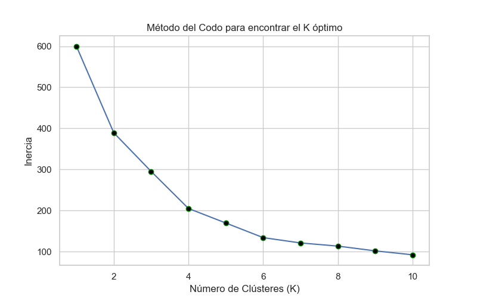
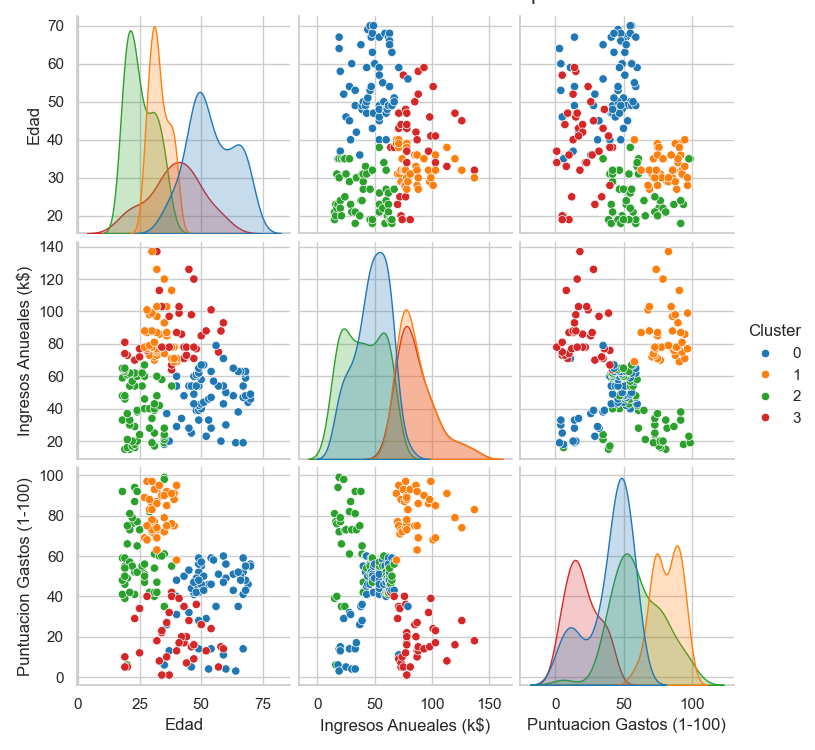

# **Informe de agrupamiento usando K-Means & Python** 📊
#
#
## Introducción:
El presente informe, creado por Miguel Esteban Parrado, tiene como objetivo mostrar y describir la solución a los requerimientos dados para el entregable AA2-EV01, correspondiente al curso ALGORITMO DE AGRUPAMIENTO NO SUPERVISADO K-MEANS CON PYTHON guiado por la instructora Diana Judith Mendez Torres.

En el presente informe, creado con el lenguaje de marcado ligero **Markdown**, se encontrarán las herramientas utilizadas para el desarrollo de susodicho entregable, como también, el paso a paso para la solución de sus requerimientos.
#

### Herramientas utilizadas:

A continuación se mostrarán las herramientas con su respectiva versión y/o documentación correspondiente para el desarrollo del entregable.

- Miniconda (25.3.1)
- Python (3.13.2)
- Librerías Python:

#

| Librería | Documentación |
| ------ | ------ |
| Pandas | https://pandas.pydata.org/ |
| NumPy | https://numpy.org/ |
| Seaborn | https://seaborn.pydata.org/ |
| Matplotlib | https://matplotlib.org/ |
| Sklearn | https://scikit-learn.org/stable/ |
| Jupyter Notebook | https://docs.jupyter.org/en/latest/ |


#
## Objetivos 🎯

- Cargar la base de datos a trabajar
- Obtener una muestra de prueba aleatoria a partir de la información inicial.
- Eliminar las variables que no aportan al modelo
- Realizar el escalamiento (normalización) de datos si es necesario.
- Obtener el valor óptimo de K (clústers) para la aplicación de algoritmo K-means.
- Entrenar el modelo, obtención de las coordenadas de los centroides.
- Realizar predicción con la muestra obtenida.

#
#

### _Carga, limpieza de datos y configuración_

A través de la librería [pandas](https://pandas.pydata.org/ ) realizamos una extracción de la base de datos para la creación de un nuevo DataFrame y posteriormente, se eliminan las columnas no utilizadas. Adicionalmente, se realiza una configuración de la librería matplotlib para la representación de gráficos en Jupyter Notebook.

```sh
import pandas as pd
import numpy as np 
import seaborn as sns 
import matplotlib.pyplot as plt 
from sklearn.cluster import KMeans 
from sklearn.preprocessing import StandardScaler 

df = pd.read_csv("Mall_Customers1.csv")
df_numerico = df.drop(columns=["IDCliente", "Genero"])

%matplotlib inline 
sns.set(style="whitegrid") 
```

#
### _Muestra de prueba aleatoria_

Gracias al método **.sample()** podemos extraer una secuencia de ejemplos aleatoria para el DataFrame.

```sh
print("Muestar aleatoria de datos:")
muestra = df.sample(frac=0.2, random_state=42) 
print(muestra)  
```

#
### _Escalamiento o normalización de datos_
Mediante la función **StandardScaler()** realizamos una normalización o estandarización de datos para que los datos de tipo numérico se aseguren de tener la misma importancia en el clustering.

```sh
scaler = StandardScaler()
df_scaled = scaler.fit_transform(df_numerico) 
```

#
### _Obtención y aplicación de valor óptimo de clústers_
A través del método del codo, el cual consiste en calcular la inercia y graficarla de tal manera que podamos visualizar la cantidad de clústers ideales que necesitaremos para el algoritmo, nos fijaremos en el vértice que simula el codo humano en la gráfica, para así, conocer el número óptimo de clústers y su implementación (aunque puede variar ese número "óptimo" de clústers).

```sh
inertia = []
K_range = range(1, 11)

for k in K_range:
    kmeans = KMeans(n_clusters=k,random_state=42)
    kmeans.fit(df_scaled) 
    inertia.append(kmeans.inertia_)
```
Una vez creada la lista vacía para almacenar las incercias, mediante un ciclo **for**, vamos a almacenar la inercia en esta lista por cada modelo con número de clústers desde el 1 al 10. Mostrando ahora una gráfica con este proceso o método del codo.

```sh
plt.figure(figsize=(8, 5))
plt.plot(K_range, inertia, marker='o', markerfacecolor='black', markeredgecolor='red')
plt.title('Método del Codo para encontrar el K óptimo')
plt.xlabel('Número de Clústeres (K)')
plt.ylabel('Inercia')
plt.grid(True)
plt.show()
```


#
### _Entrenamiento del modelo_
Una vez los datos estén limpios, preparados y tengamos el número de clústers óptimo, procederemos a crear el algoritmo o modelo k-means, para así entrenarlo, crear una nueva columna en el DataFrame llamada "Clúster" y asignar a cada registro su número de clúster correspondiente. 

```sh
print("Obtención de coordenadas por centroide:")
algoritmo = KMeans(n_clusters=4, random_state=42)
grupos = algoritmo.fit_predict(df_scaled)
df_numerico["Cluster"] = grupos

centroides_escalados = algoritmo.cluster_centers_
centroides = scaler.inverse_transform(centroides_escalados)
df_centroides = pd.DataFrame(centroides, columns=df_numerico.columns[:-1])  
df_centroides["Cluster"] = df_centroides.index
print(df_centroides)
```

#
### _Realización de predicción_
Finalmente, se muestra el gráfico de la predicción realizada por el modelo:
#

#
En el cuál podemos concluir los siguientes ítems:

- El clúster 1, refleja que las personas con una edad aproximada entre 25 a 35 años, tienen una puntuación de gastos entre las mas altas, siendo de 60 a 100 puntos de gastos.
- El clúster 0, refleja que, aproximadamente las personas con menor cantidad de ingresos, son las personas con edades entre los 40 a 70 años
- El clúster 3, refleja que, aproximadamente, las personas con ingresos entre 70 a 140 puntos, son las personas que menos gastan, entre 0 a 45 puntos
- El clúster 0 y 2, muestran una gran relación o agrupamiento de datos entre ciertos puntos de gastos e ingresos, siendo las personas con ingresos entre 45 a 55 puntos las que gastan entre 40 a 70 puntos.

#
#

### Referencias:
- Instructora: Diana Mendez 
#

_Gracias por leer..._

#
#
>"Incluso cuando te tomas unas vacaciones de la tecnología, 
>la tecnología no se toma un descanso de ti"
>-Douglas Coupland
